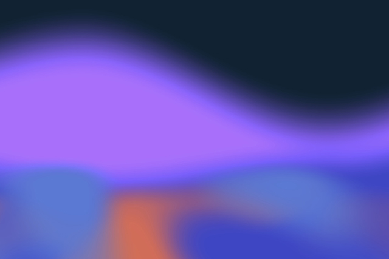

# ThreeSynthBloom 💐

ThreeSynthBloom is a visual art project built with Three.js and GLSL shaders, evoking a dreamlike ambiance through flowing synthwave-inspired visuals. 
The animation is driven by noise-based shaders that generate smooth, organic motion.

## demo shot 📷

## Built With 🔧

- [Three.js](https://threejs.org/)
- GLSL